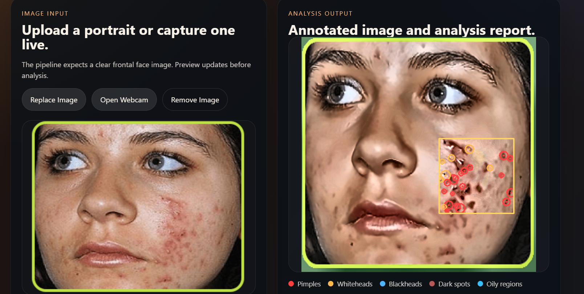

# Facial Skin Analysis System

A web-based skin analysis application that lets users upload a face image or capture one with a webcam, then analyzes visible skin conditions such as pimples, whiteheads, blackheads, dark spots, and oily skin regions. The system returns an annotated image along with a structured analysis report in a clean, user-friendly interface.


## Problem Statement
Many people want a quick and simple way to understand visible skin issues from a facial image without manually inspecting every area of the face. Traditional skin assessment often requires expert review, special tools, or time-consuming manual observation. This matters because early awareness of visible skin conditions can help users track skin changes, improve skincare decisions, and prepare better for professional consultation. The goal of this project is to make facial skin inspection faster, more accessible, and easier to understand through an AI-assisted image analysis workflow.


## AI Usage Explanation
AI is used in this project through computer vision-based facial analysis and automated visual condition detection.

Current AI/computer vision usage:

Face-focused image analysis to isolate the relevant facial region
Skin-region extraction to reduce background noise
Automated detection of visible irregularities using image-processing logic
Brightness, texture, and contrast-based estimation for oily regions and dark spots
Browser-side face guidance during webcam capture for better framing and image quality


## Pipeline

`Image Input -> Preprocessing -> Face Detection -> Skin Segmentation -> Multi-Detection Engine -> Visualization -> Response Generation`

The implementation uses lightweight OpenCV and NumPy heuristics for fast local inference:

- Face detection: Haar cascade face detection with a full-image fallback
- Skin segmentation: combined HSV and YCrCb masks with geometric exclusions for eyes and lips
- Pimples / whiteheads / blackheads: blob and intensity-based irregularity detection
- Dark spots: LAB lightness anomaly mask
- Oiliness: brightness and texture fusion score

## Backend Setup

```bash
cd backend
python -m venv .venv
.venv\Scripts\activate
pip install -r requirements.txt
uvicorn app.main:app --reload
```

Backend runs at `http://127.0.0.1:8000`.

## Frontend Setup

```bash
cd frontend
npm install
npm run dev
```

Frontend runs at `http://127.0.0.1:5173`.

## Production Deployment

This project is now containerized for deployment with Docker Compose.

```bash
docker compose up --build
```

Production URLs:

- Frontend: `http://localhost`
- Backend health: `http://localhost/api/health`

## Demo
You can present the demo like this:


## Use any of these in your submission:

Live demo: https://ai-face-p-detecting-m1euldahg-pranab-samanta-s-projects.vercel.app/

Notes:

- The frontend is served by Nginx.
- Requests to `/api/*` are proxied to the FastAPI backend.
- The frontend uses `VITE_API_BASE_URL` when provided, otherwise it defaults to:
  - dev: `http://127.0.0.1:8000`
  - production: `/api`

## API

`POST /analyze`

Accepts either:

- multipart `file`
- JSON body with `image_base64`

Returns:

- localized detections for pimples, whiteheads, and blackheads
- dark spot area ratio and mask statistics
- oiliness score and category
- annotated image as base64 PNG
